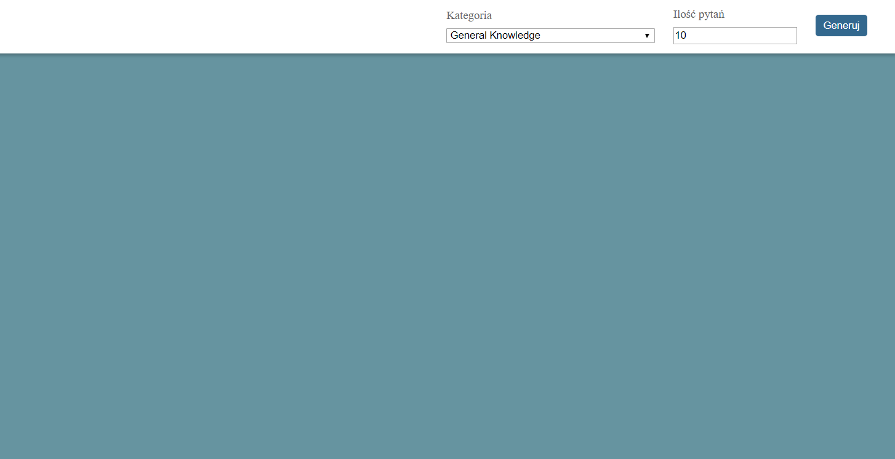
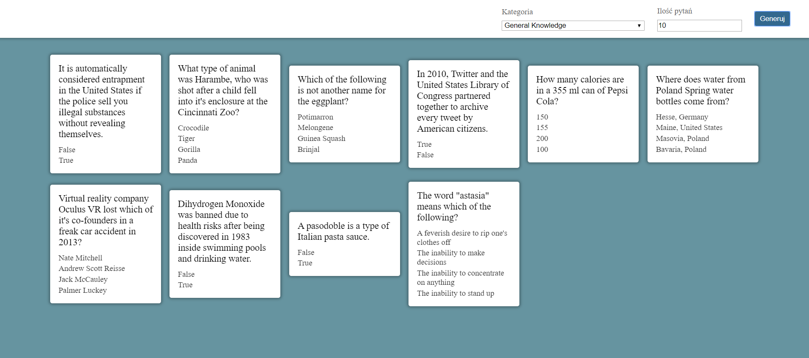
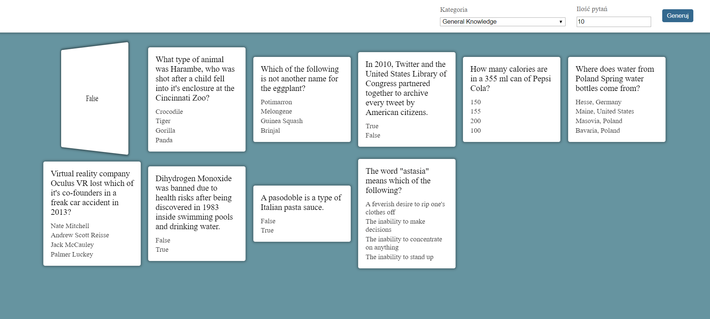
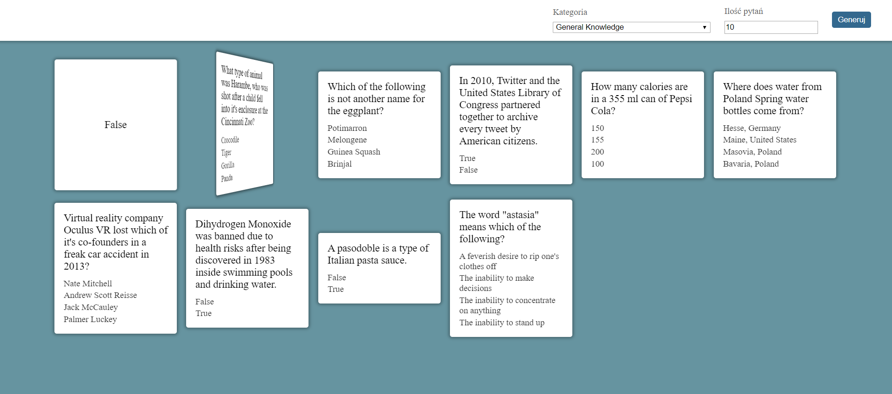
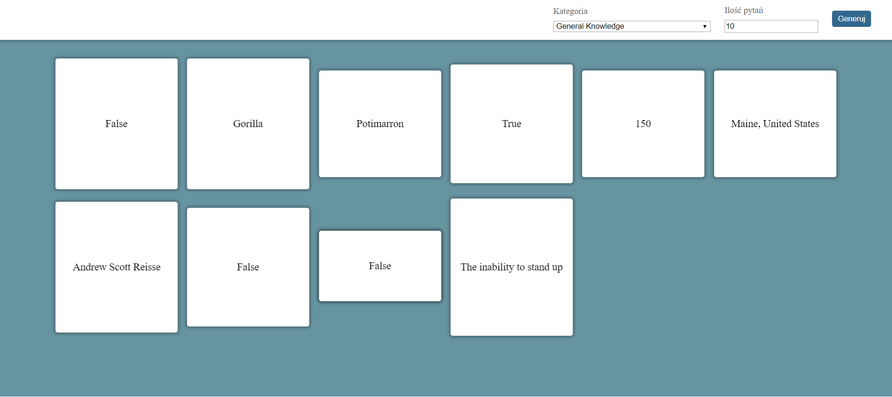
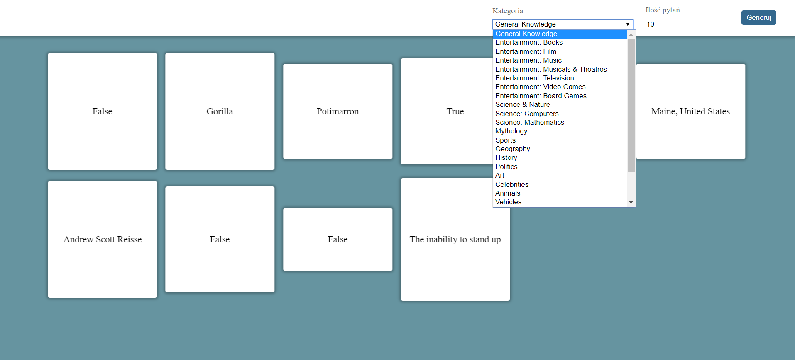

# React Quiz
> This application is a quiz in your browser.

## Table of contents
* [General info](#general-info)
* [Screenshots](#screenshots)
* [Technologies](#technologies)
* [Setup](#setup)
* [Status](#status)
* [Inspiration](#inspiration)
* [Contact](#contact)

## General info
This application is react quiz. When you open this app in your browser you can choose a category and amount of questions. Answer a question and click a card to see if you were right ;)

## Screenshots

## Technologies
* JavaScript
* React
* HTML
* CSS

## Setup
### npm i
Install node modules

### npm start
Runs the app in the development mode.
Open http://localhost:3000 to view it in the browser.

Click "Clone or download", unzip files, in this file open power shell and write "npm i" to instal node modules and next write "npm start" to runs the app.

## Status
Project is: finished

## Inspiration
Youtube tutorial and college.
Project for studies.
Github.

## Contact
Created by Emil Grabowski emil.grabowski@interia.pl
